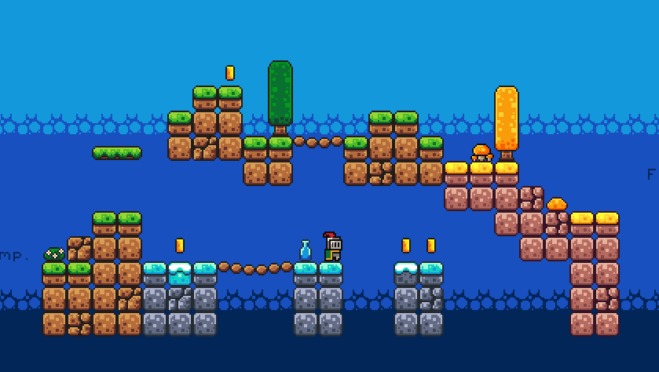

Thx for Brakeys 
https://www.youtube.com/@Brackeys
  
I genuinely believe that this beginner course for Godot stands out as one of the best available online. It’s incredibly well-structured, concise, and surprisingly comprehensive for its short duration. In just about three hours, it manages to cover a wide range of essential topics that are crucial for anyone starting out with game development in Godot.
  
One of the most impressive aspects of the course is how clearly it explains collisions. For many beginners, understanding how objects interact in a game world can be confusing, but this course breaks it down in a way that’s intuitive and easy to grasp. The lessons on movement are equally strong—whether it’s player controls or object motion, everything is demonstrated with clarity and practical examples.
  
The course also introduces autoplay features and sound playback, which are often overlooked in beginner tutorials. These elements are vital for creating immersive and polished games, and the fact that they’re included here shows the instructor’s attention to detail. The way sound is integrated into gameplay is particularly well done, giving learners a solid foundation for adding audio effects and music to their projects.
  
What makes this course truly exceptional is its pacing and accessibility. You don’t need any prior experience with Godot or programming to follow along. The explanations are friendly, the examples are relevant, and the entire experience feels like a guided journey rather than a dry lecture.
  
By the end of the course, you’ll not only understand the basics—you’ll have a working game prototype and the confidence to explore more advanced features on your own. For anyone curious about game development or looking to get started with Godot, this course is an absolute gem.

